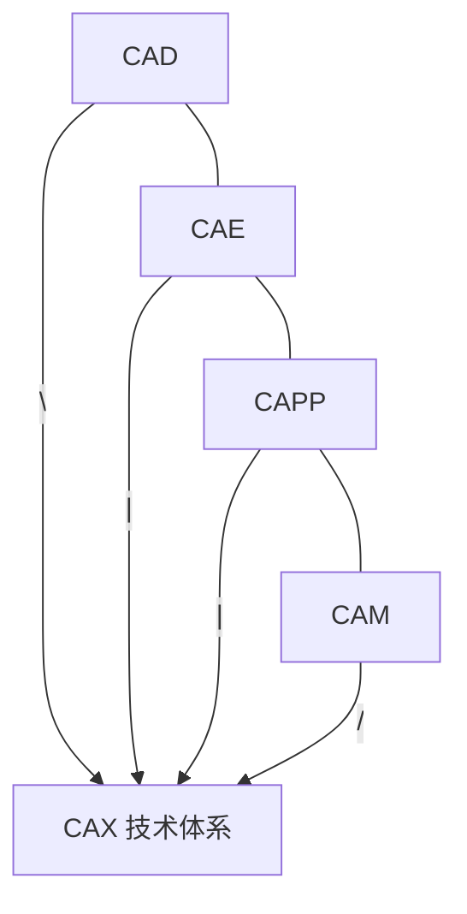

```mermaid
graph TD
    %% 定义上层四个节点（横向排列，统一样式）
    A[CAD]:::upperNode --- B[CAE]:::upperNode --- C[CAPP]:::upperNode --- D[CAM]:::upperNode
    
    %% 定义下层核心节点
    E[CAX 技术体系]:::coreNode
    
    %% 连线：还原\、|、|、/的视觉效果
    A --\--> E
    B --|--> E
    C --|--> E
    D --/--> E
```